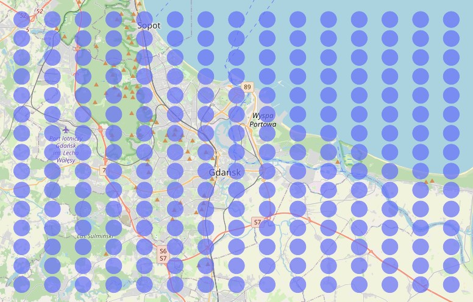
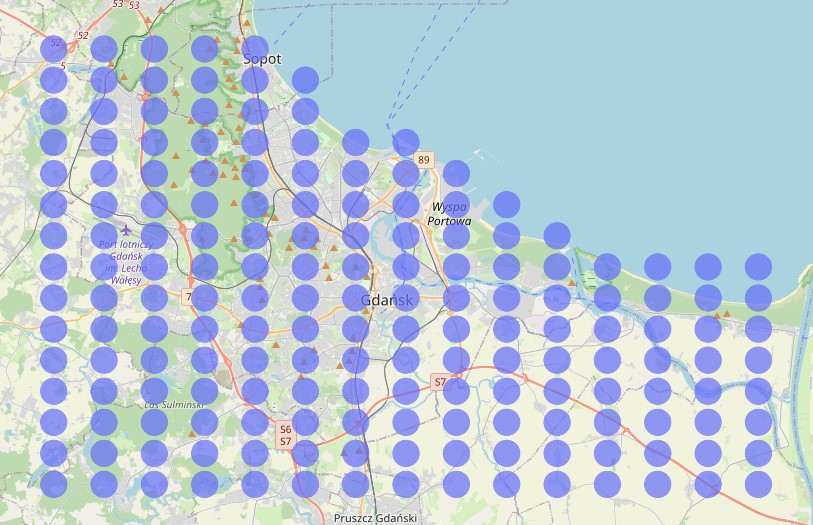
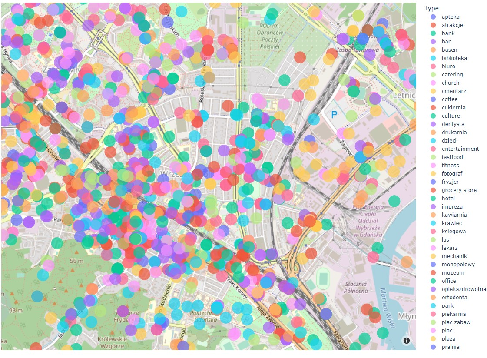

# Google Maps Scrapper

Google Maps Scrapper allows you to collect data from the given area about places of the specified type from Google Maps. The user needs to set the points which set the area of interest - the points are opposite corners of the square. The user also sets the zoom as well as the resolution of the search - the area is divided into X columns and X rows. The program will search for the places at each of the points with a set zoom. Finally, the collected data is saved in a CSV file.

## Installation

Use the package manager [pip](https://pip.pypa.io/en/stable/) to install libraries used in the project specified in the requirements.txt file.

```bash
pip install requirements.txt
```

## Usage
### Define the area of interest - set the border and measure points
Use the file *BorderAndMeasurePoints.py* to set the location of two points: point A (left upper corner) and Point B (bottom right corner) - the opposite corners of the square covering the area of interest. Use the parameter *size* to set the number of columns and rows which divide the area. Finally use the *setUpBorderPoints()* and *setUpMeasurePoints()* functions to generate the points.

```python
    # Point A (left upper corner)
    point_a_lat = 54.44856818820764
    point_a_lon = 18.42538889812534

    # Point B (right bottom corner)
    point_b_lat = 54.26192258463519
    point_b_lon = 18.943841464421837

    # number of "steps" (resolution of the division of the area --> greater value gives more details)
    size = 15

    borderPoints = setUpBorderPoints(point_a_lat, point_a_lon, point_b_lat, point_b_lon)
    setUpMeasurePoints(size, borderPoints)
```

### Visualise the measure points
Use the method *visualiseMeasurePoints()* to see the measure points on the map. The program will open the map using the Chrome browser. Measure points are represented as circles.

The measure points look like this:


Since the measure points are saved into a CSV file, it is easy to delete the location of points that are not needed in the search process, for example points at sea. Deleting needed points will optimize the search process and reduce the time needed to analyze the given area. 
The optimized measure points look like this:


### Collect the data from the Google Maps
Use the *MainScraper.py* file to collect the data from the area using the generated measure points. The program generates a URL for each measure point. The URL contains:
- the type of the searched place
- longitude and latitude of the measure point
- the zoom of search


The program opens the browser and inserts each URL. The Google Maps are searching for places nearby the measure point. The results of the search are visible in the vertical menu on the left. The menu is scrolled down several times and then the search results are saved. The scraper collects information about each place:
- link to Google Maps describing the place
- the name of the place
- the type of the place

```python
    placesResults = []
    # save the search results into a dictionary
    for el in response.xpath('//div[contains(@aria-label, "Results for")]/div/div[./a]'):
        placesResults.append({
            'link': el.xpath('./a/@href').extract_first(''),
            'title': el.xpath('./a/@aria-label').extract_first(''),
            'type': typeOfPlace
        })
```

Then the location (longitude and latitude) is extracted from the link to Google Maps describing the place and assigned to the place. All of the places are saved in a DataFrame and saved into a CSV file. 

```python
    lat = []
    lon = []
    for index, row in df.iterrows():
        link = df.at[index, 'link']
        # print(link, "\n")
        latLon = re.search('!3d(.*)!16', link).group(1).split('!4d')
        # print(latLon[0], latLon[0])
        lat.append(latLon[0])
        lon.append(latLon[1])

    df['lat'] = lat
    df['lon'] = lon

    df = df[['lat', 'lon', 'type', 'title', 'link']]  # set order of columns

    return df
```
### Visualise collected points
Use the *PlacesVisualiser.py* file to visualise the points. The function *visualiseCollectedPoints()* reads all CSV files from the *database* directory and opens the browser with a map showing all the points. The legend show the color of the circle corresponding to the type of place.



## Contributing

Pull requests are welcome. For major changes, please open an issue first to discuss what you would like to change.

## License

[MIT](https://choosealicense.com/licenses/mit/)
